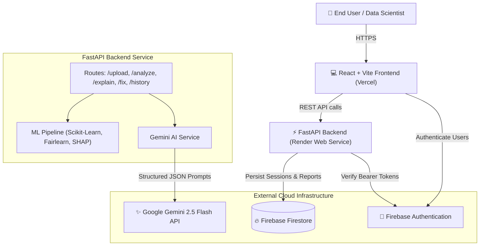

# FairLens AI — System Architecture & Design Document

**FairLens AI** is an enterprise-grade Responsible AI governance platform built during a 72-hour hackathon (winning 3rd place). It provides interactive bias detection, SHAP model explainability, and automated mitigation algorithms.

---

## High-Level Architecture Diagram

---

## Key Architectural Principles

1. **Stateful Session Store with Firebase Firestore:**  
   Session metadata, dataset column descriptors, and fairness evaluation metrics are indexed in Firebase Firestore for persistence across browser reloads.

2. **Stateless On-the-Fly ML Computation:**  
   To minimize memory overhead on Render's 512 MB free tier, lightweight Logistic Regression models and SHAP `LinearExplainer` pipelines are retrained on-demand for incoming session datasets.

3. **Graceful Degraded State (Gemini API Safety):**  
   If `GEMINI_API_KEY` is missing, invalid, or hits rate limits (429 / 5xx), the backend catches the error cleanly and returns structured fallback payloads (`{ "available": false, "message": "AI explanation temporarily unavailable" }`). Core statistical bias audits continue operating without interruption.

4. **Zero-Cost Deployment Topology:**  
   - **Frontend:** Vercel Static Web Application (`frontend/` root, `npm run build` -> `dist`).
   - **Backend:** Render Python Web Service (`backend/` root, `uvicorn app.main:app`).
   - **Database & Auth:** Firebase Firestore & Auth (Free Spark Tier).
