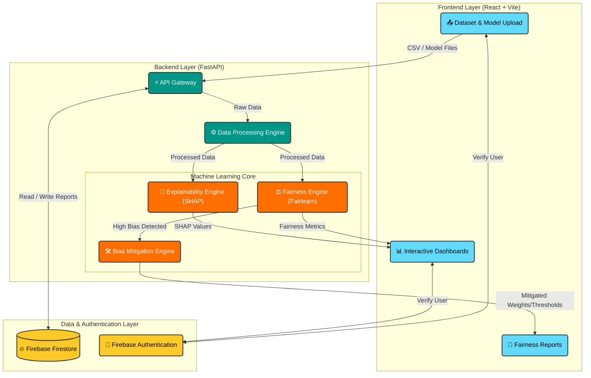
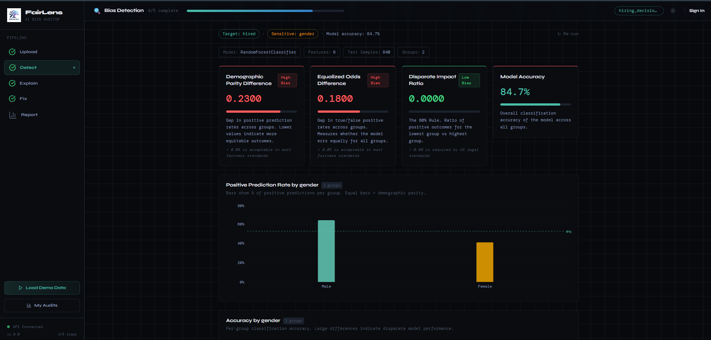
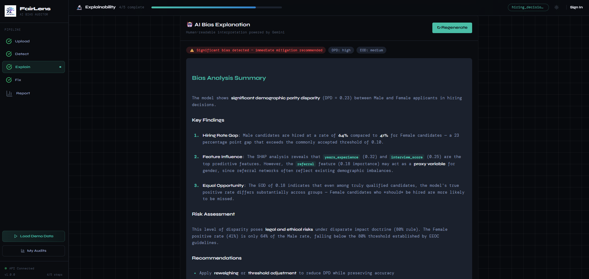
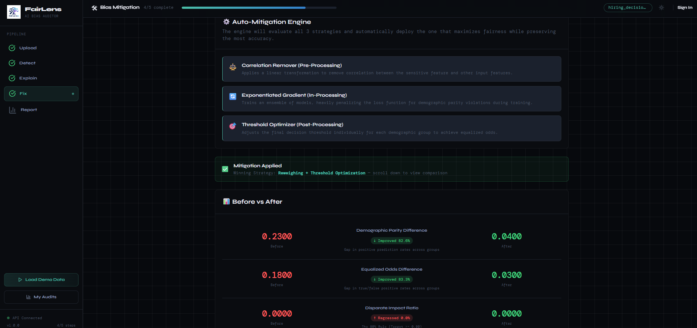
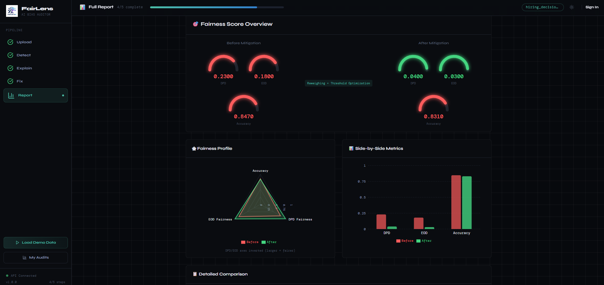

<div align="center">
  

  <h1>FairLens AI ⚖️</h1>
  
  <p><strong>AI-Powered Fairness Auditing, Explainability, and Bias Mitigation Platform</strong></p>

  <p>
    <em>Empowering developers, students, researchers, and organizations to build responsible, unbiased machine learning systems.</em>
  </p>

  <h3>🥉 3rd Prize Winner – HackNova Online Challenge 2026</h3>

  <!-- Badges Section -->
  <p>
    
    
    
    
    
    
    
    
  </p>
</div>

---

## 🛑 The Problem Statement

In the era of ubiquitous Artificial Intelligence, models are increasingly making decisions that impact human lives—from loan approvals and hiring to criminal justice and healthcare. However, AI is not inherently neutral. Machine learning systems often inherit, amplify, and perpetuate historical biases present in their training data.

Without proper auditing, biased AI can lead to discriminatory outcomes, legal liabilities, and erosion of public trust. The challenge developers face is that detecting and mitigating these biases often requires specialized knowledge, complex mathematical formulations, and convoluted workflows.

## 💡 Why FairLens AI?

FairLens AI was built to democratize **Responsible AI**. It bridges the gap between complex fairness mathematics and practical engineering.

We provide an intuitive, end-to-end platform that allows anyone—from a solo developer to an enterprise data science team—to:

1. **Audit** models for discriminatory behavior across demographic groups.
2. **Understand** the root causes of model decisions using state-of-the-art explainability (XAI).
3. **Mitigate** detected bias using automated, robust techniques, ensuring equitable outcomes.

## ✨ Key Features

| Feature                           | Description                                                                                                                   |
| :-------------------------------- | :---------------------------------------------------------------------------------------------------------------------------- |
| 📊 **Automated Fairness Audits**  | Upload your dataset and model predictions to instantly identify biased outcomes across sensitive attributes.                  |
| ⚖️ **Comprehensive Bias Metrics** | Calculates standard fairness metrics including Demographic Parity, Equalized Odds, and Disparate Impact.                      |
| 🧠 **SHAP Explainability**        | Dive deep into model decisions with SHAP (SHapley Additive exPlanations) to see exactly _why_ a model made a specific choice. |
| 🛠️ **Bias Mitigation Engine**     | Automatically apply re-weighting or threshold optimization to mitigate identified biases.                                     |
| 📈 **Interactive Dashboards**     | Visualize complex fairness data through beautiful, responsive React/Recharts dashboards.                                      |
| 🔄 **Before vs After Comparison** | Visually compare model fairness and performance before and after applying mitigation techniques.                              |
| 📂 **Demo Datasets**              | Get started immediately using built-in, pre-loaded datasets (e.g., Adult Census Income, COMPAS).                              |

## 🏗️ Architecture Overview

The system is designed with a decoupled architecture, ensuring scalability and performance for heavy machine learning workloads.



## ⚙️ AI Pipeline: How It Works

1. **Ingestion:** Users upload a dataset (CSV) alongside model predictions and specify sensitive features (e.g., race, gender, age).
2. **Processing:** Pandas and Scikit-Learn preprocess the data, handle missing values, and encode categorical variables.
3. **Auditing:** The Fairness Engine calculates disparity metrics across the sensitive groups.
4. **Explainability:** The SHAP engine calculates feature importances to reveal which variables are driving the bias.
5. **Mitigation (Optional):** If bias exceeds acceptable thresholds, the Mitigation Engine applies fairness algorithms to adjust the dataset weights or prediction thresholds.
6. **Reporting:** A comprehensive "Before vs. After" report is generated and persisted to Firebase.

## 🎥 Project Preview

<div align="center">
  <video src="public/Videos/Fairlens-AI-Preview.mp4" controls="controls" muted="muted" width="800"></video>
  <br/>
  <i>(If the video doesn't load, you can view it on <a href="https://drive.google.com/file/d/1eroNN4jK3YIyA6n6CxAcboKqtZSCM-HE/view?usp=drive_link">Google Drive</a> or <a href="public/Videos/Fairlens-AI-Preview.mp4">download it here</a>)</i>
</div>

## 📸 Screenshots

|                                           Bias Detection Dashboard                                           |                                             AI Bias Explanation                                             |
| :----------------------------------------------------------------------------------------------------: | :---------------------------------------------------------------------------------------------------: |
|  |  |
|                            _High-level overview of model fairness health._                             |                       _Deep dive into feature contributions driving the bias._                       |

|                                         Mitigation Results & Fixes                                          |                                          Fairness Report Summary                                          |
| :------------------------------------------------------------------------------------------------: | :--------------------------------------------------------------------------------------------------: |
|  |  |
|                    _Comparing fairness metrics before and after mitigation._                     |                      _Comprehensive audit report for compliance._                       |

## 🚀 Live Demo

> **Note:** The live deployment is currently being updated. In the meantime, you can easily run the application locally!

- 🌐 **Live Demo:** `[Coming Soon]`
- 📊 **Demo Dataset:** Included in the repository under `/data/demo`
- 📑 **Example Reports:** `[Coming Soon]`

## 💻 Tech Stack

| Category              | Technologies                                               |
| :-------------------- | :--------------------------------------------------------- |
| **Frontend**          | React, TypeScript, Vite, Tailwind CSS, Shadcn UI, Recharts |
| **Backend**           | FastAPI, Python (3.10+)                                    |
| **Data Science & ML** | Pandas, Scikit-Learn, NumPy                                |
| **Responsible AI**    | Fairlearn, SHAP                                            |
| **Database & Auth**   | Firebase Firestore, Firebase Authentication                |

## 📁 Project Structure

```text
fairlens-ai/
├── backend/                  # FastAPI Application
│   ├── app/
│   │   ├── api/              # RESTful endpoints
│   │   ├── core/             # Configuration and security
│   │   ├── db/               # Firebase models and connections
│   │   ├── ml/               # Fairness, SHAP, and Mitigation engines
│   │   └── services/         # Business logic
│   ├── requirements.txt      # Python dependencies
│   └── main.py               # Application entry point
├── frontend/                 # React Application
│   ├── src/
│   │   ├── components/       # Reusable UI components (Shadcn UI)
│   │   ├── hooks/            # Custom React hooks
│   │   ├── pages/            # Application views/routes
│   │   ├── services/         # API client
│   │   └── utils/            # Helper functions
│   ├── package.json          # Node dependencies
│   └── vite.config.ts        # Vite configuration
└── README.md                 # Project documentation
```

## 🚀 Live Production Deployment

FairLens AI is configured for 100% free production deployment using **Vercel** for the frontend and **Render** for the backend.

- 🌐 **Live Frontend (Vercel):** `https://fairlens-ai.vercel.app` *(Replace with your deployed URL)*
- ⚡ **Live Backend API (Render):** `https://fairlens-backend.onrender.com` *(Replace with your deployed URL)*
- 💚 **API Health Check:** `https://fairlens-backend.onrender.com/health`

For complete step-by-step instructions on deploying your own instance on Vercel and Render free tier, see [DEPLOYMENT_GUIDE.md](file:///d:/Projects/fairlens-ai/DEPLOYMENT_GUIDE.md).

## 🛠️ Installation Guide

Follow these steps to run FairLens AI locally on your machine.

### Prerequisites

- Node.js (v18+)
- Python (3.10+)
- Firebase Project credentials (optional, for persistent storage)

### 1. Clone the Repository

```bash
git clone https://github.com/yourusername/fairlens-ai.git
cd fairlens-ai
```

### 2. Setup the Backend

```bash
cd backend
# Create and activate virtual environment
python -m venv venv
source venv/bin/activate  # On Windows use: venv\Scripts\activate

# Install dependencies
pip install -r requirements.txt

# Start the FastAPI server
uvicorn app.main:app --reload
```

_The backend API will be available at `http://localhost:8000`_

### 3. Setup the Frontend

```bash
# Open a new terminal and navigate to the frontend directory
cd frontend

# Install dependencies
npm install

# Start the Vite development server
npm run dev
```

_The frontend application will be available at `http://localhost:5173`_

## 📖 Usage Guide & Example Workflow

1. **Sign In / Guest Mode:** Launch the application and select a demo dataset to start immediately without uploading data.
2. **Configure Audit:** Select the sensitive attributes you want to audit for (e.g., `gender`, `race`).
3. **Run Audit:** Click "Run Fairness Audit". The backend will process the data and return the fairness metrics.
4. **Analyze Results:** Review the dashboard. Are the Disparate Impact scores below the industry standard of 0.8? Which features are highlighted by SHAP as heavily influencing the bias?
5. **Mitigate:** Navigate to the Mitigation tab. Select a mitigation strategy (e.g., Correlation Remover or Threshold Optimization).
6. **Compare:** View the "Before vs. After" comparison to see how the fairness metrics improved and how model accuracy was affected.

## 🏆 Hackathon Journey

**HackNova Online Challenge 2026**

FairLens AI was conceptualized, designed, and fully developed by a solo developer over a rigorous one-week period for the HackNova Online Challenge.

- **May 17, 2026:** Initial idea submission focusing on the critical need for accessible AI auditing tools.
- **May 20, 2026:** Selected for the Top 30 Development Phase from a highly competitive pool of applicants.
- **May 21–23, 2026:** 72-hour intensive development sprint. Architected the FastAPI backend, integrated Fairlearn/SHAP, built the React frontend, and connected Firebase.
- **May 24, 2026:** Final presentation and evaluation.
- **Result:** 🥉 Awarded **3rd Prize** overall!

## 🚧 Challenges Faced

Building a comprehensive ML platform in 72 hours presented several unique challenges:

- **Mathematical Complexity:** Translating dense fairness mathematics from `Fairlearn` into intuitive, actionable UI components that non-experts can understand.
- **Performance:** Calculating SHAP values for large datasets is computationally expensive. Optimized the backend to sample data appropriately to ensure the API responds in real-time without timing out.
- **State Management:** Managing complex, multi-step ML workflows (Upload -> Audit -> Explain -> Mitigate) seamlessly on the frontend.

## 🗺️ Future Roadmap

FairLens AI is evolving from a hackathon prototype into a robust open-source platform.

### Phase 1: Core Enhancements (Current)

- [ ] Export reports as PDF/CSV.
- [ ] Add support for custom PyTorch/TensorFlow models via API.
- [ ] Implement robust user authentication and project workspaces.

### Phase 2: Advanced Intelligence

- [ ] **LLM-Powered Recommendations:** Integrate an LLM to explain the fairness metrics in plain English and recommend specific actions.
- [ ] **Multi-Model Benchmarking:** Compare the fairness of multiple models side-by-side.
- [ ] **Automated Report Generation:** Schedule automated audits.

### Phase 3: Enterprise Scale

- [ ] **Dataset Drift Monitoring:** Continuous monitoring of data streams for emergent biases over time.
- [ ] **Responsible AI Assistant:** A conversational agent to guide users through the auditing process.
- [ ] **Enterprise Analytics:** Organizational dashboards for compliance tracking.

## 🌍 Impact

FairLens AI is designed to benefit the entire AI ecosystem:

- 🎓 **Students & Educators:** A practical tool to learn and teach the concepts of AI fairness and ethics.
- 🔬 **Researchers:** A visual platform to quickly experiment with and benchmark different bias mitigation techniques.
- 👨‍💻 **Data Scientists:** A streamlined workflow to audit models before deploying them to production.
- 🚀 **Startups & Enterprises:** A compliance tool to ensure AI systems align with ethical guidelines and emerging regulations (e.g., EU AI Act).

## 🤝 Contributing

Contributions are what make the open source community such an amazing place to learn, inspire, and create. Any contributions you make are **greatly appreciated**.

1. Fork the Project
2. Create your Feature Branch (`git checkout -b feature/AmazingFeature`)
3. Commit your Changes (`git commit -m 'Add some AmazingFeature'`)
4. Push to the Branch (`git push origin feature/AmazingFeature`)
5. Open a Pull Request

Please read `CONTRIBUTING.md` for details on our code of conduct, and the process for submitting pull requests to us.

## 📄 License

Distributed under the MIT License. See `LICENSE` for more information.

---

<div align="center">
  <i>Built with ❤️ for a fairer, more transparent AI future.</i>
</div>
