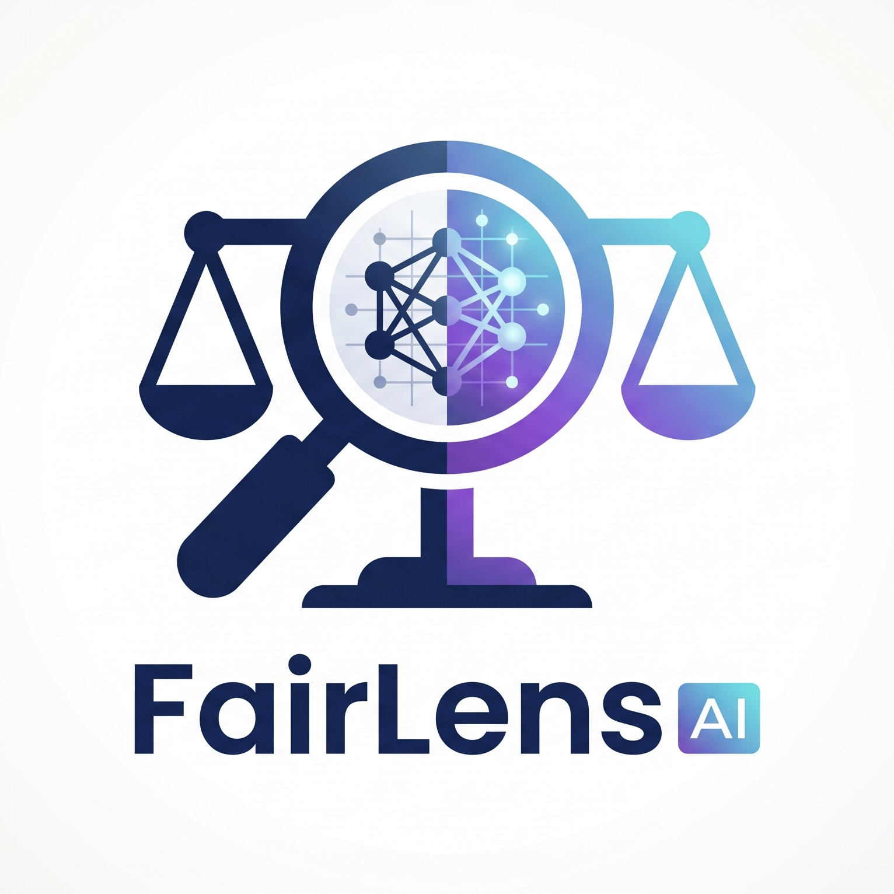
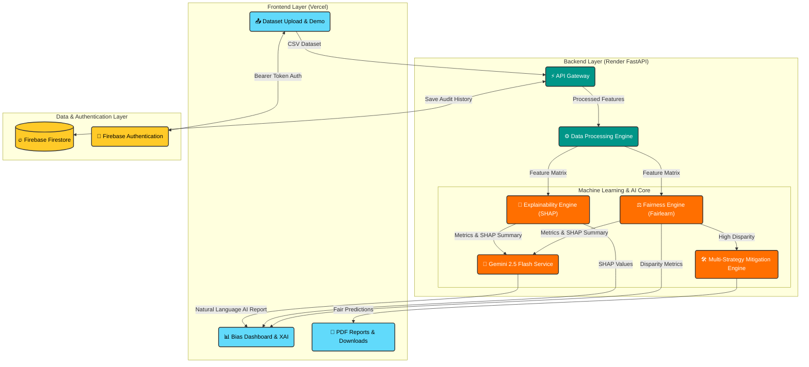

<div align="center">
  

  <h1>FairLens AI ⚖️</h1>
  
  <p><strong>AI-Powered Fairness Auditing, Explainability, and Bias Mitigation Platform</strong></p>

  <p>
    <em>Empowering developers, students, researchers, and organizations to build responsible, unbiased machine learning systems.</em>
  </p>

  <h3>🥉 3rd Prize Winner – HackNova Online Challenge 2026</h3>

  <!-- Badges Section -->
  <p>
    
    
    
    
    
    
    
    
    
  </p>
</div>

---

## 🛑 The Problem Statement

In the era of ubiquitous Artificial Intelligence, models are increasingly making decisions that impact human lives—from loan approvals and hiring to criminal justice and healthcare. However, AI is not inherently neutral. Machine learning systems often inherit, amplify, and perpetuate historical biases present in their training data.

Without proper auditing, biased AI can lead to discriminatory outcomes, legal liabilities, and erosion of public trust. The challenge developers face is that detecting and mitigating these biases often requires specialized knowledge, complex mathematical formulations, and convoluted workflows.

## 💡 Why FairLens AI?

FairLens AI was built to democratize **Responsible AI**. It bridges the gap between complex fairness mathematics and practical engineering.

We provide an intuitive, end-to-end platform that allows anyone—from a solo developer to an enterprise data science team—to:

1. **Audit** models for discriminatory behavior across demographic groups.
2. **Understand** the root causes of model decisions using state-of-the-art explainability (XAI) and Gemini AI insights.
3. **Mitigate** detected bias using automated multi-strategy algorithms, ensuring equitable outcomes.

## ✨ Key Features

| Feature                           | Description                                                                                                                               |
| :-------------------------------- | :---------------------------------------------------------------------------------------------------------------------------------------- |
| 📊 **Automated Fairness Audits**  | Upload your CSV dataset to instantly identify biased outcomes across sensitive attributes (race, gender, age).                            |
| ⚖️ **Comprehensive Bias Metrics** | Calculates standard fairness metrics including Demographic Parity, Equalized Odds, and Disparate Impact Ratio.                            |
| 🧠 **SHAP Explainability**        | Dive deep into model decisions with SHAP (SHapley Additive exPlanations) to reveal exact feature contributions to bias.                   |
| 🤖 **Gemini AI Natural Language** | Get instant, plain-English executive summaries and actionable recommendations powered by Google Gemini 2.5 Flash.                         |
| 🛠️ **Multi-Strategy Mitigation**  | Automatically apply Pre-processing (CorrelationRemover), In-processing (ExponentiatedGradient), and Post-processing (ThresholdOptimizer). |
| 📈 **Interactive Dashboards**     | Visualize complex fairness metrics through responsive React/Recharts charts and side-by-side comparisons.                                 |
| 📄 **PDF & CSV Export**           | Export audit reports as clean PDFs or download the mitigated fair dataset for downstream production use.                                  |
| 📂 **Instant Demo Datasets**      | Get started immediately with pre-loaded datasets (Adult Census Income, COMPAS recidivism).                                                |

## 🏗️ Architecture Overview

The system uses a decoupled microservices architecture designed for deployment on free tier cloud hosting.



## ⚙️ AI Pipeline: How It Works

1. **Ingestion:** Users upload a dataset (CSV) or load demo data, specifying target and sensitive attributes.
2. **Processing:** Pandas and Scikit-Learn clean data, encode categorical variables, and train a baseline model.
3. **Auditing:** The Fairness Engine calculates disparity metrics across sensitive groups.
4. **Explainability:** The SHAP engine calculates feature importances to reveal drivers of bias.
5. **AI Summarization:** Gemini 2.5 Flash analyzes metrics and generates an executive summary with mitigation recommendations.
6. **Mitigation:** The Multi-Strategy Engine evaluates CorrelationRemover, ExponentiatedGradient, and ThresholdOptimizer to select the optimal fairness/accuracy tradeoff.
7. **Export & Persistence:** Reports can be exported to PDF, mitigated datasets downloaded as CSV, and audit sessions saved to Firebase Firestore.

## 🚀 Live Production Deployment

FairLens AI is configured for 100% free production deployment using **Vercel** (Frontend) and **Render** (Backend).

- 🌐 **Live Frontend (Vercel):** `https://fairlens-ai-nine.vercel.app/`
- ⚡ **Live Backend API (Render):** `https://fairlens-ai-backend-skog.onrender.com`
- 💚 **API Health Check:** `https://fairlens-ai-backend-skog.onrender.com/health`
- 🎯 **API Ready Check:** `https://fairlens-ai-backend-skog.onrender.com/ready`

## 💻 Tech Stack

| Category              | Technologies                                                  |
| :-------------------- | :------------------------------------------------------------ |
| **Frontend**          | React 18, TypeScript, Vite, Tailwind CSS, Shadcn UI, Recharts |
| **Backend**           | FastAPI, Uvicorn, Python 3.10                                 |
| **Data Science & ML** | Pandas, Scikit-Learn, NumPy                                   |
| **Responsible AI**    | Fairlearn, SHAP                                               |
| **Generative AI**     | Google Gemini 2.5 Flash API (Tenacity Retry + Fallback)       |
| **Database & Auth**   | Firebase Firestore, Firebase Authentication                   |

## 📁 Project Structure

```text
fairlens-ai/
├── backend/                  # FastAPI Application
│   ├── app/
│   │   ├── api/              # RESTful router endpoints
│   │   ├── core/             # Settings, CORS, security, JWT auth
│   │   ├── db/               # Database session & models
│   │   ├── ml/               # Fairness, SHAP, and Mitigation engines
│   │   ├── routes/           # Upload, analyze, explain, fix, history
│   │   └── services/         # Firebase Admin & Gemini AI services
│   ├── requirements.txt      # Python dependencies
│   ├── render.yaml           # Render deployment configuration
│   └── runtime.txt           # Python 3.10.12 runtime specification
├── frontend/                 # React + Vite Application
│   ├── src/
│   │   ├── components/       # UI components (Detect, Explain, Fix, Report)
│   │   ├── context/          # AppContext state management
│   │   ├── lib/              # API client, PDF exporter, Firebase client
│   │   ├── pages/            # Index, History, Login, Register
│   │   └── types/            # TypeScript data contracts
│   ├── package.json          # Node dependencies
│   ├── vercel.json           # Vercel SPA rewrite configuration
│   └── vite.config.ts        # Vite build configuration
└── README.md                 # Project documentation
```

## 🛠️ Installation & Local Development

### Prerequisites

- Node.js (v18+)
- Python (3.10+)
- Firebase Project credentials (optional for local dev)

### 1. Clone the Repository

```bash
git clone https://github.com/himanshu-jadhav108/fairlens-ai-.git
cd fairlens-ai-
```

### 2. Setup the Backend

```bash
cd backend
python -m venv venv
source venv/bin/activate  # On Windows use: venv\Scripts\activate

# Install dependencies
pip install -r requirements.txt

# Start the FastAPI server
uvicorn app.main:app --reload
```

_Backend API will run at `http://localhost:8000`_

### 3. Setup the Frontend

```bash
# Open a new terminal and navigate to frontend
cd frontend

# Install dependencies
npm install

# Start the Vite dev server
npm run dev
```

_Frontend web app will run at `http://localhost:5173`_

## 📖 Usage Workflow

1. **Upload or Demo Data:** Select a pre-loaded dataset (Adult Census / COMPAS) or upload a custom CSV dataset.
2. **Configure Audit:** Choose the target column (e.g. `income`) and sensitive attribute (e.g. `race`, `sex`).
3. **Run Audit:** View interactive fairness dashboards showing Demographic Parity Difference, Equalized Odds, and Disparate Impact Ratio.
4. **SHAP & Gemini AI:** Explore feature importance impact and read plain-English executive recommendations generated by Gemini AI.
5. **Mitigate & Download:** Click "Fix Bias" to evaluate multi-strategy mitigation algorithms and download the fair dataset as CSV or export the report as PDF.

## 🏆 Hackathon Journey

**HackNova Online Challenge 2026**

- 🏆 Awarded **3rd Prize Winner** overall!
- Developed as a hackathon project to make AI auditing accessible, visual, and actionable for developers worldwide.

## 📄 License

Distributed under the MIT License. See `LICENSE` for more information.

---

<div align="center">
  <i>Built with ❤️ for a fairer, more transparent AI future.</i>
</div>
