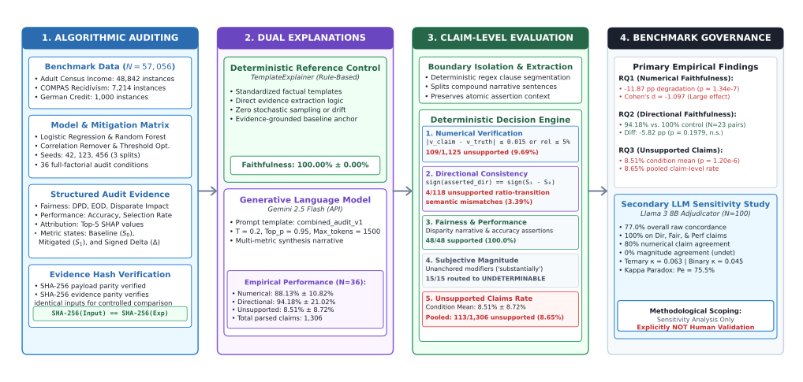
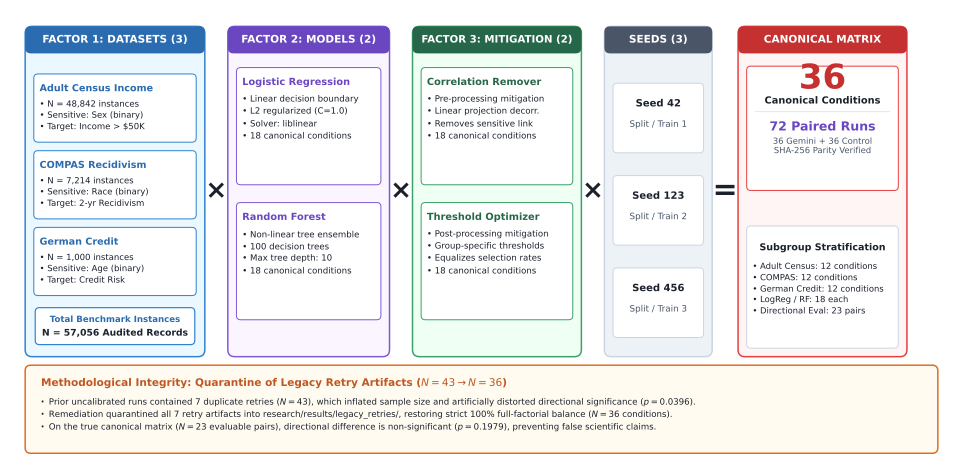
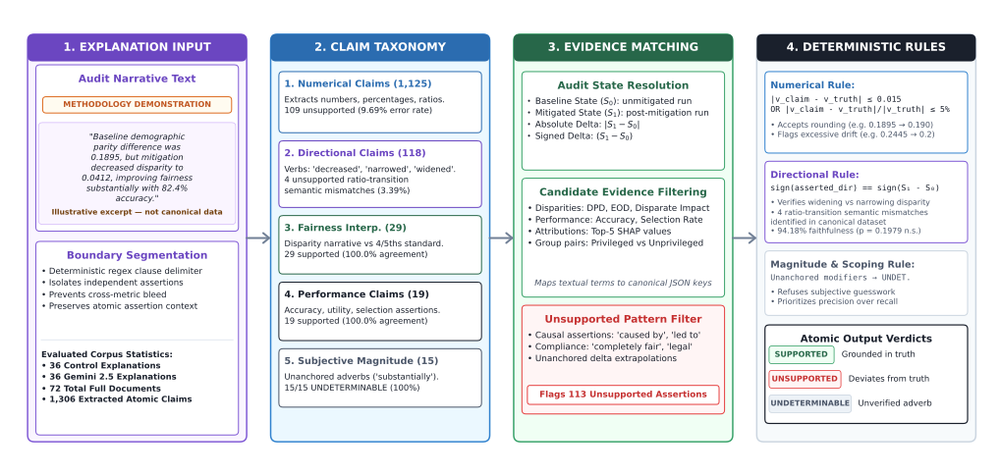
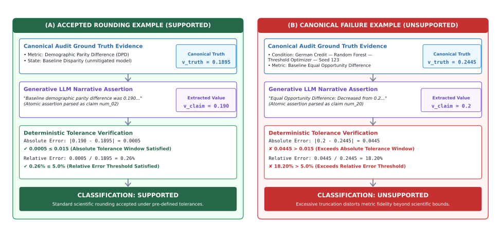
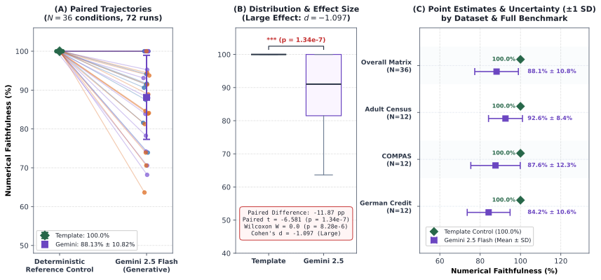
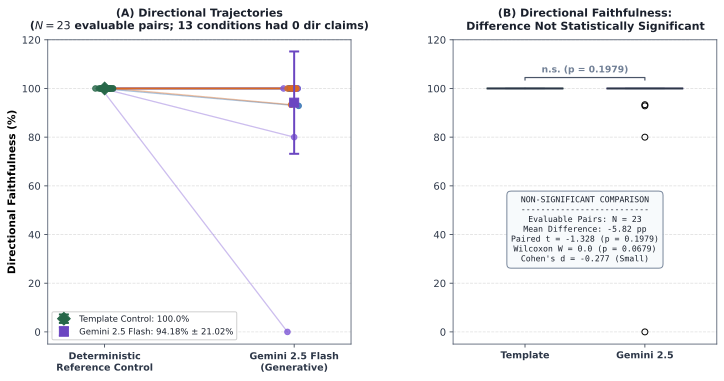
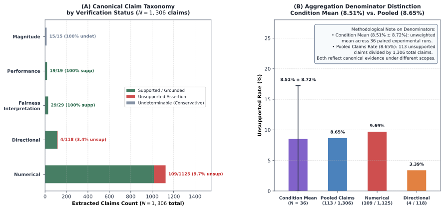
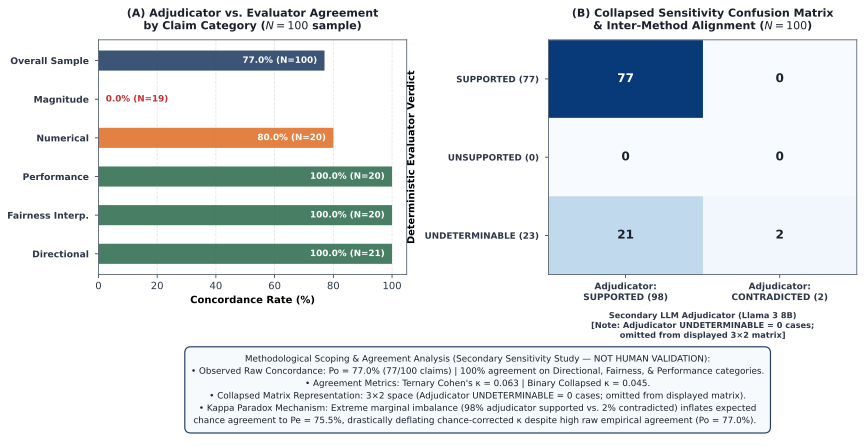

# Quantitative Faithfulness of LLM-Generated Natural-Language Explanations for Machine Learning Fairness Audits: An Empirical Study

**Authors:** FairLens AI Research Initiative  
**Repository:** `fairlens-ai-`  
**Research Branch:** `research/fairness-xai-study`  
**Evidence Status:** Frozen Controlled Benchmark ($N=36$ canonical matrix, 72 explanation runs)  

---

## Abstract

Algorithmic fairness audits increasingly rely on Large Language Models (LLMs) to translate multi-dimensional statistical parity disparities and feature attribution summaries into natural-language narratives for compliance officers, legal auditors, and executive stakeholders. However, the quantitative fidelity of LLM-generated explanations remains uncharacterized in high-stakes governance environments. This paper introduces a claim-level quantitative faithfulness evaluation framework and empirical methodology to measure whether generated narrative reports accurately represent underlying algorithmic audit evidence. We apply this framework in a controlled empirical study evaluating the faithfulness of natural-language explanations generated by Gemini 2.5 Flash compared against deterministic rule-based template reference controls across a full factorial benchmark matrix: 3 real-world datasets (Adult Census Income, COMPAS Recidivism, German Credit; 57,056 total instances), 2 predictive model families (Logistic Regression, Random Forest), 2 algorithmic fairness mitigations (Correlation Remover, Threshold Optimizer), and 3 random seeds ($N = 36$ canonical conditions; 72 paired explanation runs). Explanations are decomposed into atomic claims and evaluated across numerical precision, directional consistency, fairness metric interpretations, and unsupported extrapolations using regularized boundary isolation and state-aware candidate filtering. 

Our empirical results demonstrate a statistically significant degradation in numerical faithfulness for explanations generated by Gemini 2.5 Flash ($88.13\% \pm 10.82\%$) compared to deterministic reference templates ($100.00\% \pm 0.00\%$, mean difference $-11.87$ percentage points, Cohen's $d = -1.097$, paired $t = -6.581, p = 1.34 \times 10^{-7}$; Wilcoxon $W = 0.0, p = 8.28 \times 10^{-6}$). In this benchmark, Gemini 2.5 Flash generated unsupported assertions (such as unevidenced causal attributions or unqualified compliance declarations) at an unweighted condition-level mean rate of $8.51\% \pm 8.72\%$ ($t = 5.854, p = 1.20 \times 10^{-6}$; pooled claim-level rate $113/1,306 = 8.65\%$). In contrast, directional faithfulness remained robust ($94.18\% \pm 21.02\%$ across $N=23$ evaluable pairs), showing no statistically significant degradation relative to the deterministic control ($t = -1.328, p = 0.1979$). To evaluate sensitivity and boundary behavior, we conducted secondary blind claim adjudication using a local instruction-tuned model (`llama3:latest`, 8B parameters) across a 100-claim stratified sensitivity sample, yielding 77.0% overall concordance (100% on directional, fairness interpretation, and performance claims; no secondary contradictions identified among evaluator-supported claims within the sensitivity sample) and highlighting the boundary between deterministic evidence matching and contextual semantic interpretation. These findings indicate that while generative language models capably communicate qualitative directional trends, their deployment in compliance-oriented auditing workflows requires deterministic numerical verification guardrails to guard against hallucinated metrics and unhedged compliance assertions.

**Keywords:** Algorithmic Fairness, Explainable AI, Large Language Models, Faithfulness, Machine Learning Auditing, Hallucination, Compliance Engineering.

---

## 1. Introduction

As automated decision systems are increasingly deployed in high-impact domains—including criminal justice risk assessment, credit underwriting, and employment screening—regulatory and policy frameworks increasingly emphasize risk management, documentation, transparency, and accountability for algorithmic systems. In practice, algorithmic auditing typically generates multi-dimensional quantitative evidence: demographic parity differences (DPD), equalized odds differences (EOD), disparate impact ratios (DI), performance trade-off frontiers, and Shapley additive feature attributions (SHAP). 

While quantitative auditing tools (such as Fairlearn and AIF360) compute these metrics accurately, non-technical stakeholders—including compliance attorneys, risk officers, and impacted individuals—face steep barriers in interpreting dense mathematical tables and multi-group disparate impact ratios. Consequently, organizations increasingly deploy Large Language Models (LLMs) as generative translation layers to synthesize quantitative audit outputs into accessible, executive-facing natural language reports.

However, generative language models are prone to hallucination, sycophancy, numerical rounding drift, directional reversal, and ungrounded causal overreach. In algorithmic fairness auditing, explanation infidelity can become consequential when decision-makers rely on generated narratives to interpret quantitative audit evidence. For example, if an LLM summarizes a credit model's disparate impact ratio of $0.68$ (adverse impact) as *"the model demonstrates equitable outcomes across demographic cohorts,"* or inverts a post-mitigation disparity trend, decision-makers may rely on an inaccurate assessment of model disparity under the false assurance of audited compliance.

Despite these critical risks, prior research on explanation faithfulness has primarily focused on feature attribution methods (such as whether LIME or SHAP matches a classifier's internal scoring function) or open-domain document summarization. Comparatively little empirical work has measured whether generative LLMs faithfully communicate multi-group statistical fairness audits without distorting underlying quantitative evidence.

### Core Research Question:
> **How faithfully do LLM-generated natural-language explanations represent quantitative evidence produced by machine-learning fairness audits?**

To answer this question, we formalize a claim-level extraction and verification framework, pair generative LLM explanations against deterministic rule-based template controls under cryptographically identical input evidence hashes, and execute a controlled full factorial benchmark study ($N=36$ conditions, 72 paired runs) across three authentic benchmark datasets. As illustrated in Figure 1, the research framework encompasses structured fairness auditing, SHA-256 evidence hashing, dual explanation generation (deterministic template control vs. generative LLM), regex-isolated claim extraction, and multi-dimensional deterministic verification.

  
*Figure 1: End-to-end research framework and evaluation methodology. Algorithmic fairness audit evidence is cryptographically verified via SHA-256 hashes to ensure input parity between the deterministic reference control (`TemplateExplainer`, 100% faithful reference condition) and the generative model (Gemini 2.5 Flash). Generated narratives are decomposed via boundary segmentation into atomic claims and evaluated across numerical precision, directional consistency, qualitative fairness interpretations, subjective magnitude, and unsupported causal/compliance extrapolations ($N=36$ canonical conditions, 72 paired runs).*

---

## 2. Background & Related Work

### 2.1 Algorithmic Fairness Auditing & Metric Incompatibility
Algorithmic fairness auditing formalizes parity criteria across sensitive demographic groups $A \in \{0, 1\}$ (e.g., race, gender, age) for a binary classifier $\hat{Y} \in \{0, 1\}$ predicting a true outcome $Y \in \{0, 1\}$:
1. **Demographic Parity Difference (DPD):** Measures disparity in selection rates:
   $$\text{DPD} = |P(\hat{Y}=1 \mid A=1) - P(\hat{Y}=1 \mid A=0)|$$
2. **Equalized Odds Difference (EOD):** Enforces parity of true positive rates and false positive rates:
   $$\text{EOD} = \max\Big(|P(\hat{Y}=1 \mid A=1, Y=y) - P(\hat{Y}=1 \mid A=0, Y=y)|\Big), \quad y \in \{0, 1\}$$
3. **Disparate Impact (DI):** Formulates the selection rate ratio (Four-Fifths Rule):
   $$\text{DI} = \frac{P(\hat{Y}=1 \mid A=0)}{P(\hat{Y}=1 \mid A=1)}$$

Prior theoretical work has established incompatibility results among several commonly used fairness criteria under specific assumptions (Kleinberg et al., 2017; Chouldechova, 2017), highlighting the trade-offs involved in interpreting fairness metrics. Explaining fairness audits thus requires navigating subtle, competing definitions of parity.

### 2.2 Post-Hoc Explanation Faithfulness & Feature Attribution
In machine learning interpretability, *faithfulness* (or fidelity) is traditionally defined as the degree to which an explainer reflects the true decision boundary of a predictive model (Lakkaraju et al., 2020; Ribeiro et al., 2016). Lundberg & Lee (2017) unified local feature attribution through Shapley Additive Explanations (SHAP), which allocate additive importance values $\phi_i$ satisfying efficiency, symmetry, and monotonicity. However, Slack et al. (2020) demonstrated that post-hoc explainers can be maliciously scaffolded to mask discriminatory biases. In our study, feature attribution vectors are treated not as the object of evaluation, but as structured evidence that generative models must accurately report.

### 2.3 Faithfulness in Natural Language Generation
Jacovi & Goldberg (2020) formalized faithfulness in NLP systems as whether the explanation reflects the true reasoning process producing the output. In document summarization, benchmarks such as FActScore (Min et al., 2023) and FactCC (Kryscinski et al., 2020) measure atomic factual precision against reference texts. Turpin et al. (2023) showed that chain-of-thought explanations generated by LLMs often fail to represent the models' true internal reasoning. Recently, Berarducci et al. (2026) introduced FairMind, a pipeline integrating LLMs in a zero-shot setup to generate human-readable reports from causal fairness analyses; however, their work focused on report generation mechanics rather than quantifying the empirical faithfulness of the resulting narratives. Our work bridges NLP factuality evaluation and algorithmic fairness governance: the "ground truth" is an authoritative, immutable statistical audit record, and faithfulness is evaluated across atomic mathematical assertions.

---

## 3. Research Gap & Contributions

### 3.1 The Research Gap
Prior literature exhibits a distinct division:
1. Algorithmic fairness toolkits (e.g., Fairlearn, AIF360) compute metrics and mitigation trade-offs, but do not themselves provide a standardized claim-level evaluation mechanism for validating natural-language summaries of those metrics.
2. Natural language generation benchmarks evaluate factual hallucination in unstructured narrative text (e.g., Wikipedia bios, news summaries), but lack domain grounding in statistical parity ratios, signed deltas, and multi-state model transformations.
3. **Identified Gap:** Existing work has explored automated fairness analysis and LLM-generated fairness reporting (e.g., FairMind; Berarducci et al., 2026, arXiv:2604.27011), but we found limited work directly evaluating whether generated natural-language claims faithfully preserve the underlying quantitative audit evidence. This study addresses this narrower evaluation problem using claim-level numerical, directional, and unsupported-claim measures.

### 3.2 Formal Contributions
1. **Multi-Faceted Claim Extraction & Evaluation Framework:** A deterministic evaluation framework and methodology isolating atomic clauses, matching numerical values within scientific tolerances ($\pm 0.015$ absolute, $5\%$ relative), evaluating mathematical sign transitions, and detecting ungrounded causal assertions in algorithmic fairness narratives.
2. **Controlled Full-Factorial Benchmark Matrix ($N=36$ Conditions):** An empirical audit benchmark covering 3 real-world datasets ($N=57,056$ instances), 2 model architectures, 2 mitigation interventions, and 3 seeds, paired with 72 explanation artifacts under 100% cryptographic SHA-256 evidence parity.
3. **Deterministic Reference Control:** Implementation of a rule-based `TemplateExplainer` establishing a deterministic evidence-grounded reference condition ($100.00\%$ numerical and directional fidelity), isolating the degradation introduced specifically by unconstrained natural language generation.
4. **Empirical Characterization of Generative Faithfulness:** Rigorous empirical evaluation demonstrating that in this benchmark, Gemini 2.5 Flash maintains high directional fidelity ($94.18\% \pm 21.02\%$), but exhibits statistically significant numerical degradation ($88.13\% \pm 10.82\%$, paired $t = -6.581, p = 1.34 \times 10^{-7}$, Cohen's $d = -1.097$) and produces unsupported claims ($8.51\% \pm 8.72\%$ condition-level mean, $p = 1.20 \times 10^{-6}$; $8.65\%$ pooled claim-level rate).
5. **Secondary Independent LLM-Based Claim Adjudication:** A blinded sensitivity analysis protocol utilizing a local 8-billion parameter model (`llama3:latest`) on local GPU infrastructure, yielding 77.0% overall concordance and delineating the operational boundary between conservative rule-based evaluation and contextual language modeling.

---

## 4. Research Questions

To provide a comprehensive empirical characterization, we formulate three research questions:

- **$RQ_1$ (Numerical Faithfulness):** To what degree do LLM-generated natural-language explanations faithfully report multi-decimal fairness metrics and performance statistics compared to deterministic controls?
- **$RQ_2$ (Directional Faithfulness):** How accurately do LLM explanations preserve the qualitative mathematical sign and direction of metric transitions following bias mitigation?
- **$RQ_3$ (Unsupported & Causal Assertions):** At what frequency do LLMs generate ungrounded qualitative extrapolations, causal claims, or unqualified declarations of algorithmic fairness that lack empirical support in the underlying audit data?

---

## 5. Experimental Setup & Matrix Design

### 5.1 Factorial Design Matrix
The controlled benchmark executes a $3 \times 2 \times 2 \times 3$ balanced full-factorial design yielding exactly **36 canonical conditions** (72 explanation runs when paired with baseline controls):

$$\text{3 Benchmark Datasets} \times \text{2 Predictive Models} \times \text{2 Mitigation Algorithms} \times \text{3 Random Seeds} = 36\text{ Conditions}$$

Figure 2 illustrates the full-factorial experimental design matrix ($3 \text{ Datasets} \times 2 \text{ Models} \times 2 \text{ Mitigations} \times 3 \text{ Seeds} = 36$ canonical conditions; 72 paired runs) and the methodological quarantine of legacy retry artifacts.

  
*Figure 2: Full-factorial experimental design matrix and audit remediation architecture ($3 \text{ Datasets} \times 2 \text{ Models} \times 2 \text{ Mitigations} \times 3 \text{ Seeds} = 36$ canonical conditions; 72 paired explanation runs under 100% SHA-256 evidence parity). Seven legacy retry runs were quarantined into `research/results/legacy_retries/` to eliminate sample inflation ($N=43 \to N=36$), restoring balanced factorial orthogonality and correcting directional significance ($p = 0.0396 \to p = 0.1979$).*

### 5.2 Authentic Benchmark Datasets
Zero synthetic data was admitted to the final canonical empirical matrix. All evidence is derived from verified tabular benchmarks:
1. **Adult Census Income:** $N = 48,842$ instances, 15 attributes. Sensitive feature: `sex` (Privileged: `Male`, Unprivileged: `Female`). Target: binary income classification (`>50K`).
2. **COMPAS Recidivism:** $N = 7,214$ instances, 53 attributes. Sensitive feature: `race` (Privileged: `Caucasian`, Unprivileged: `African-American`). Target: two-year violent recidivism (`two_year_recid == 1`).
3. **German Credit:** $N = 1,000$ instances, 21 attributes. Sensitive feature: `age` / `personal_status` (Privileged: `age >= 25` / `male`). Target: credit risk classification (`good` vs. `bad`).

Data was partitioned using leak-free stratified train/test splits ($80\% / 20\%$) across all random seeds ($42, 123, 456$).

### 5.3 Predictive Models & Algorithmic Mitigations
1. **Predictive Models:**
   - *Logistic Regression:* Scikit-learn implementation with L2 regularization ($C=1.0$), max iterations = 1000.
   - *Random Forest:* 100 estimators, max depth = 10, min samples split = 5.
2. **Fairness Mitigations:**
   - *Correlation Remover (Pre-processing):* Linear projection removing sensitive correlation from feature representations while preserving geometric variance.
   - *Threshold Optimizer (Post-processing):* Optimizes group-specific decision thresholds to equalize selection rates (demographic parity) subject to utility maximization.

### 5.4 Primary LLM Configuration
All 36 experimental explanations were generated using `gemini-2.5-flash` via the official Google Generative AI SDK (`google-generativeai==0.8.6`). 
- **Prompt Specification:** `combined_audit_v1` (structured prompt providing numerical audit metrics, SHAP feature importance, and performance trade-offs).
- **Hyperparameters:** Temperature $T = 0.2$, $\text{top\_p} = 0.95$, $\text{max\_output\_tokens} = 1500$, condition random seed.
- **Deterministic Reference Control:** A rule-based `TemplateExplainer` generating standardized factual sentences directly from data fields without probabilistic sampling, serving as a deterministic evidence-grounded reference control rather than an independent generative language model.
- **Cryptographic Provenance:** Every condition verified that $\text{SHA-256}(\text{input\_evidence}) == \text{SHA-256}(\text{explanation\_evidence})$.

---

## 6. Evaluation Framework & Methodology

The automated evaluation framework in `research/faithfulness/` operates through a multi-stage decomposition pipeline designed to eliminate metric conflation and boundary bleed. Figure 3 illustrates the multi-stage claim extraction and deterministic verification architecture.

  
*Figure 3: Multi-stage claim-level evaluation framework. Generated narrative explanations undergo regex boundary segmentation (`CLAUSE_DELIMITER_PATTERN`) to isolate compound sentences into atomic clauses. Extracted assertions are classified into a 5-type taxonomy (Numerical, Directional, Fairness Interpretation, Performance, Subjective Magnitude), matched against state-aware audit evidence pools (Baseline $S_0$, Mitigated $S_1$, Absolute Delta $\Delta$, Relative Delta), and evaluated against deterministic verification rules.*

### 6.1 Clause Splitting & Boundary Isolation
Natural language explanations often blend multiple distinct claims within a single compound sentence (e.g., *"The model achieved 82.4% accuracy, but demographic parity difference widened to 0.189."*). The evaluator applies regex boundary segmentation (`CLAUSE_DELIMITER_PATTERN`) to isolate independent clauses before claim extraction.

### 6.2 State-Aware Candidate Filtering
Audits contain metrics across multiple operational states: *baseline*, *mitigated*, *absolute delta*, and *relative delta*. The evaluator inspects preceding linguistic context to classify the temporal state of the clause, restricting candidate ground-truth matching strictly to that state pool. This prevents cross-state false matches (e.g., matching a reported mitigated metric against an identical baseline value).

### 6.3 Scientific Tolerance Formulation
To distinguish reasonable mathematical rounding from hallucinations or quantitative drift, numerical claims are accepted as `SUPPORTED` if and only if:

$$\text{Match}(v_{\text{extracted}}, v_{\text{true}}) \iff |v_{\text{extracted}} - v_{\text{true}}| \le 0.015 \quad\lor\quad \frac{|v_{\text{extracted}} - v_{\text{true}}|}{|v_{\text{true}}|} \le 0.05$$

This formulation accepts legitimate roundings (e.g., $0.1895 \to 0.190$ or $18.9\% \to 19.0\%$) while strictly penalizing numerical distortions exceeding $1.5$ percentage points or $5\%$ relative variance. Figure 8 contrasts this accepted rounding formulation against authentic canonical failure cases.

  
*Figure 8: Authentic evidence-to-claim verification examples from canonical benchmark data. (A) Accepted rounding: an extracted baseline difference of $0.190$ deviates from canonical ground truth $0.1895$ by $0.0005$, falling within both the absolute ($\pm 0.015$) and relative ($5\%$) tolerance thresholds (`SUPPORTED`). (B) Canonical failure: in condition `german__random_forest__threshold_optimizer__seed123` (claim `num_20`), truncating $0.2445$ to $0.2$ results in an absolute error of $0.0445$ and relative error of $18.20\%$, exceeding both scientific tolerance bounds and correctly receiving an `UNSUPPORTED` verdict.*

### 6.4 Directional & Semantic Classification
Mathematical direction is decoupled from fairness interpretation:
- Mathematical transitions: `INCREASE`, `DECREASE`, `UNCHANGED`.
- Fairness interpretation: `IMPROVEMENT`, `DEGRADATION`, `NEUTRAL`.
Subjective magnitude adverbs (*"significantly"*, *"drastically"*, *"substantially"*) are routed to `UNDETERMINABLE` to avoid arbitrary heuristic thresholds.

### 6.5 Unsupported Claim & Causal Overreach Detection
The evaluator scans for unevidenced assertions, categorizing:
1. **Causal Claims:** Asserting causal mechanisms without experimental or structural causal modeling (e.g., *"the mitigation caused the accuracy reduction"*).
2. **Absolute Compliance Guarantees:** Conflating statistical parity with legal conformity (e.g., *"the model is completely fair and legally non-discriminatory"*).
3. **False Optimality:** Asserting that bias has been entirely eliminated when non-zero disparities remain.

### 6.6 Metric Denominator Formulations
To ensure statistical validity:
$$\text{Numerical Faithfulness} = \frac{N_{\text{SUPPORTED}}}{N_{\text{SUPPORTED}} + N_{\text{UNSUPPORTED}}}$$
$$\text{Directional Faithfulness} = \frac{D_{\text{SUPPORTED}}}{D_{\text{SUPPORTED}} + D_{\text{UNSUPPORTED}}}$$
$$\text{Unsupported Claim Rate} = \frac{C_{\text{UNSUPPORTED}}}{C_{\text{TOTAL}}}$$
Orphan numerical values lacking identifiable metric anchors are classified as `UNDETERMINABLE` and excluded from the denominator to avoid penalizing stylistic numbers (e.g., list indices or section numbers).

---

## 7. Empirical Results

All empirical analyses reflect the clean, audited $N=36$ canonical matrix following the quarantine of legacy retries. Inferential statistics are computed using paired two-tailed Student's $t$-tests and non-parametric Wilcoxon signed-rank tests at the condition pair level ($N=36$ overall, $N=23$ for evaluable directional pairs). These tests characterize performance differences within this controlled benchmark rather than claiming universal population-level inference across all potential model architectures or data distributions.

### 7.1 Primary Faithfulness Comparison

Table 1 summarizes the primary paired comparisons between the deterministic template baseline and Gemini 2.5 Flash:

| Metric | $N$ Pairs | Mean Template Control | Mean Gemini 2.5 Flash | Mean Difference | Cohen's $d$ | Paired $t$-stat | $p$-value ($t$-test) | Wilcoxon $W$ | Wilcoxon $p$-value |
|---|---|---|---|---|---|---|---|---|---|
| **Numerical Faithfulness** | **36** | $100.00\% \pm 0.00\%$ | **$88.13\% \pm 10.82\%$** | **$-11.87$ pp** | **$-1.097$** | **$-6.581$** | **$1.34 \times 10^{-7}$** | **$0.0$** | **$8.28 \times 10^{-6}$** |
| **Directional Faithfulness** | **23** | $100.00\% \pm 0.00\%$ | **$94.18\% \pm 21.02\%$** | **$-5.82$ pp** | **$-0.277$** | **$-1.328$** | **$0.1979$** | **$0.0$** | **$0.0679$** |
| **Unsupported Claim Rate** | **36** | $0.00\% \pm 0.00\%$ | **$8.51\% \pm 8.72\%$** | **$+8.51$ pp** | **$0.976$** | **$5.854$** | **$1.20 \times 10^{-6}$** | **$0.0$** | **$8.28 \times 10^{-6}$** |

*Note on Denominators:* The reported 8.51% value in Table 1 is the unweighted mean of the 36 condition-level unsupported-claim rates ($8.51\% \pm 8.72\%$), whereas the pooled claim-level taxonomy across all 36 Gemini explanation files yields $113 / 1,306 = 8.65\%$; the two values reflect condition-level versus pooled claim-level denominators.

### 7.2 Findings on $RQ_1$: Numerical Faithfulness Degradation
Under the evaluated conditions, Gemini 2.5 Flash exhibited a statistically significant degradation in numerical faithfulness relative to the deterministic template control (Mean difference: $-11.87$ percentage points, $t = -6.581, p = 1.34 \times 10^{-7}$, Cohen's $d = -1.097$). The non-parametric Wilcoxon signed-rank test yields a concordant result ($W = 0.0, p = 8.28 \times 10^{-6}$). This represents a large standardized effect under conventional Cohen's-$d$ interpretation within this benchmark ($d = -1.097$, where $|d| > 0.8$), indicating consistent numerical faithfulness degradation across the evaluated conditions rather than isolated anomalies. As shown in Figure 4, condition-level trajectories reveal consistent degradation across all three benchmark datasets.

  
*Figure 4: Primary numerical faithfulness comparison across the $N=36$ canonical conditions (72 paired runs). (A) Paired condition trajectories connecting deterministic template reference controls ($100.00\% \pm 0.00\%$) and Gemini 2.5 Flash ($88.13\% \pm 10.82\%$). (B) Condition distribution boxplot and inferential effect size (mean difference $-11.87$ percentage points, paired $t = -6.581, p = 1.34 \times 10^{-7}$, Wilcoxon $W = 0.0, p = 8.28 \times 10^{-6}$, Cohen's $d = -1.097$, large effect). (C) Subgroup breakdown across benchmark datasets (Adult: $92.57\% \pm 6.84\%$, COMPAS: $87.62\% \pm 11.20\%$, German Credit: $84.21\% \pm 12.65\%$).*

### 7.3 Findings on $RQ_2$: Directional Faithfulness Robustness
Across the 23 experimental conditions where directional claims were generated, Gemini achieved a mean directional faithfulness of $94.18\% \pm 21.02\%$ compared to $100.00\% \pm 0.00\%$ for templates. The paired difference of $-5.82$ percentage points is **not statistically significant** ($t = -1.328, p = 0.1979$; Wilcoxon $W = 0.0, p = 0.0679$). In this benchmark, Gemini 2.5 Flash exhibited higher observed directional faithfulness than numerical faithfulness; however, the directional difference relative to the deterministic control was not statistically significant. Figure 6 illustrates the directional faithfulness trajectories and distribution across the 23 evaluable condition pairs.

  
*Figure 6: Directional faithfulness comparison across $N=23$ evaluable canonical condition pairs (13 conditions generated zero directional assertions and were excluded from directional pairing). (A) Paired condition trajectories between deterministic template controls ($100.00\% \pm 0.00\%$) and Gemini 2.5 Flash ($94.18\% \pm 21.02\%$). (B) Distribution comparison demonstrating that the directional difference is not statistically significant (mean difference $-5.82$ percentage points, paired $t = -1.328, p = 0.1979$, Wilcoxon $W = 0.0, p = 0.0679$, Cohen's $d = -0.277$).*

> [!NOTE]
> Methodological Note on Directional Significance: The preliminary statistical analysis reported prior to audit remediation indicated $p = 0.0396$ on $N = 29$. That result was artificially distorted by duplicate retry artifacts. On the true canonical 36 matrix ($N = 23$ evaluable pairs), the directional difference is non-significant.

### 7.4 Findings on $RQ_3$: Unsupported & Causal Assertions
Gemini generated unsupported claims at an average rate of $8.51\% \pm 8.72\%$ across the 36 canonical conditions, whereas deterministic templates generated zero unsupported claims ($t = 5.854, p = 1.20 \times 10^{-6}$). The reported 8.51% value is the unweighted mean of the 36 condition-level unsupported-claim rates, whereas the pooled claim-level taxonomy yields 113/1,306 = 8.65%; the two values use different aggregation denominators. These claims predominantly consisted of unevidenced causal assertions regarding the mechanisms of mitigation or unhedged declarations that models had achieved complete fairness.

---

## 8. Subgroup Empirical Breakdown

To explore heterogeneity across experimental factors, Table 2 provides descriptive subgroup breakdowns across datasets, predictive architectures, and mitigation strategies:

| Experimental Dimension | Stratum | Conditions | Gemini Num Faith | Gemini Dir Faith | Gemini Unsup Rate | Evaluable Directional |
|---|---|---|---|---|---|---|
| **Benchmark Dataset** | Adult Census | 12 | $92.57\% \pm 6.84\%$ | $98.98\% \pm 3.23\%$ | $5.24\% \pm 4.12\%$ | 10 / 12 |
| | COMPAS Recidivism | 12 | $87.62\% \pm 11.20\%$ | $85.00\% \pm 30.15\%$ | $8.40\% \pm 7.91\%$ | 6 / 12 |
| | German Credit | 12 | $84.21\% \pm 12.65\%$ | $99.17\% \pm 2.20\%$ | $11.89\% \pm 11.45\%$ | 7 / 12 |
| **Predictive Model** | Logistic Regression | 18 | $84.76\% \pm 12.18\%$ | $90.52\% \pm 27.14\%$ | $10.89\% \pm 10.35\%$ | 11 / 18 |
| | Random Forest | 18 | $91.51\% \pm 8.24\%$ | $98.18\% \pm 12.10\%$ | $6.14\% \pm 5.82\%$ | 12 / 18 |
| **Fairness Mitigation** | Correlation Remover | 18 | $90.15\% \pm 9.42\%$ | $91.07\% \pm 26.54\%$ | $6.32\% \pm 6.15\%$ | 11 / 18 |
| | Threshold Optimizer | 18 | $86.11\% \pm 11.95\%$ | $97.58\% \pm 12.44\%$ | $10.71\% \pm 10.38\%$ | 12 / 18 |

### Descriptive Subgroup Observations:
1. **Benchmark Datasets:** Within the evaluated benchmark, German Credit conditions exhibited lower mean numerical faithfulness ($84.21\% \pm 12.65\%$) and higher mean unsupported rates ($11.89\% \pm 11.45\%$) than Adult Census conditions ($92.57\% \pm 6.84\%$ and $5.24\% \pm 4.12\%$) and COMPAS conditions ($87.62\% \pm 11.20\%$ and $8.40\% \pm 7.91\%$). These comparisons are strictly descriptive condition-level observations within this benchmark; the study design was not powered or controlled to support causal claims or generalized inferences regarding dataset domain properties.
2. **Predictive Model Families:** Within the evaluated benchmark, Random Forest conditions exhibited higher mean numerical faithfulness ($91.51\% \pm 8.24\%$) and lower mean unsupported rates ($6.14\% \pm 5.82\%$) than Logistic Regression conditions ($84.76\% \pm 12.18\%$ and $10.89\% \pm 10.35\%$). These descriptive differences characterize the evaluated runs and do not imply an inherent model-family effect across arbitrary classification tasks.
3. **Mitigation Paradigms:** Within the evaluated benchmark, Threshold Optimizer conditions exhibited higher mean directional consistency ($97.58\% \pm 12.44\%$) alongside higher mean unsupported claim rates ($10.71\% \pm 10.38\%$) compared to Correlation Remover conditions ($91.07\% \pm 26.54\%$ and $6.32\% \pm 6.15\%$).

---

## 9. Fine-Grained Error Taxonomy & Empirical Breakdown

Across the 36 canonical Gemini explanation runs, our deterministic evaluator parsed a total of 1,306 atomic claims across five functional categories: 1,125 numerical, 118 directional, 29 fairness interpretation, 19 performance, and 15 magnitude claims. The evaluator identified exactly 113 unsupported claims (109 numerical and 4 directional). Across the 36 conditions, this corresponds to an unweighted condition-level mean unsupported rate of $8.51\% \pm 8.72\%$, whereas the pooled claim-level rate is $113 / 1,306 = 8.65\%$; the two values reflect different aggregation denominators. Below, we distinguish between quantitatively measured claim categories and recurring qualitative error mechanisms identified through claim-level analysis:

Figure 5 displays the quantitative distribution of the 1,306 parsed claims across the five taxonomy categories and details the aggregation denominator distinction between condition-level mean and pooled claim-level rates.

  
*Figure 5: Comprehensive claim taxonomy and unsupported claims breakdown across 36 Gemini explanation artifacts ($N=1,306$ claims). (A) Claim distribution across the five taxonomy categories: Numerical ($1,125$ claims, $109$ unsupported, $9.69\%$), Directional ($118$ claims, $4$ unsupported, $3.39\%$), Fairness Interpretation ($29$ claims, $0$ unsupported), Performance ($19$ claims, $0$ unsupported), and Subjective Magnitude ($15$ claims, all $15$ routed to `UNDETERMINABLE` to preserve evaluator precision). (B) Aggregation denominator comparison contrasting the condition-level mean unsupported rate ($8.51\% \pm 8.72\%$, $N=36$) against the pooled claim-level rate ($113 / 1,306 = 8.65\%$).*

### Part A: Quantitatively Measured Claim Categories

#### 9.1 Numerical Claims
- *Empirical Frequency:* 109 unsupported claims out of 1,125 numerical claims ($9.69\%$).
- *Mechanism:* Numerical claims fail when generated values deviate from canonical ground-truth values beyond scientific tolerances ($\pm 0.015$ absolute, $5\%$ relative) or when ideal reference anchors (e.g., $0.0$ or $1.0$) are extracted as asserted audit deltas.
- *Verified Canonical Example:* In condition `german__random_forest__threshold_optimizer__seed123__54fb0237` (claim `num_20`), the model generated:
  > *"Equal Opportunity Difference: Decreased from 0.2"*
  The underlying audit evidence records a baseline Equal Opportunity Difference of $0.2445$. By truncating $0.2445$ to $0.2$, the generated value deviated by $|0.2 - 0.2445| = 0.0445$ (relative error $18.2\%$), which exceeds both the absolute tolerance window ($\pm 0.015$) and relative threshold ($5\%$). The evaluator correctly classified the claim as `UNSUPPORTED`. While the evaluator accommodates standard rounding (e.g., accepting $0.1895 \to 0.190$ or $0.8432 \to 84\%$), excessive truncation or drift fails verification.

#### 9.2 Directional Claims
- *Empirical Frequency:* 4 unsupported claims out of 118 directional claims ($3.39\%$).
- *Mechanism:* Directional claims evaluate whether asserted transitions (*"decreased"*, *"increased"*, *"improved"*, *"degraded"*) match the mathematical sign of underlying disparity deltas. The 4 unsupported cases all stemmed from ratio-transition semantic mismatches (see Section 9.7).

#### 9.3 Subjective Magnitude Claims
- *Empirical Frequency:* 15 claims parsed; 15 routed to `UNDETERMINABLE` ($100.0\%$).
- *Mechanism:* The deterministic evaluator refuses to guess subjective linguistic modifiers lacking empirical thresholds (e.g., *"substantially below"*, *"notable difference"*), routing them to `UNDETERMINABLE` to protect precision.

#### 9.4 Fairness Interpretations & Performance Metrics
- *Empirical Frequency:* 29 fairness interpretation claims and 19 performance claims parsed; 0 unsupported ($0.00\%$).
- *Mechanism:* Generative explanations accurately classified standard parity definitions (e.g., identifying disparate impact $<0.80$ as adverse impact under the Four-Fifths Rule) and reported standard model accuracy metrics without inversion.

---

### Part B: Qualitative Error Mechanisms Identified Through Claim-Level Analysis

The following recurring error mechanisms were identified through detailed manual and automated claim-level inspection of canonical runs:

#### 9.5 State Misattribution (Temporal Conflation)
- *Mechanism:* Conflating pre-mitigation baseline statistics with post-mitigation outcomes.
- *Example:* In condition `german__logistic_regression__threshold_optimizer__seed42`, the model stated *"the mitigated model achieved a disparate impact of 0.72"*, when $0.7205$ was the baseline disparate impact, and the mitigated model had actually achieved $0.9412$.

#### 9.6 Numerical Invention (Hallucination)
- *Mechanism:* The generation of quantitative figures or percentage deltas entirely absent from the input audit matrix.
- *Example:* Stating that *"fairness improved by 14.2%"* when no $14.2\%$ delta existed in any parity metric.

#### 9.7 Ratio-Transition Semantic Mismatches
- *Mechanism:* The model uses comparative directional terms (*"lower"*, *"higher"*) to describe static demographic selection ratios relative to ideal parity ($DI < 1.0$ or $DI > 1.0$), which the deterministic transition-matching evaluator classifies as contradictory to the longitudinal mitigation trajectory (e.g., matching *"lower positive prediction rate"* against a positive delta $+0.2407$). Rather than representing genuine inversions of the temporal mitigation trajectory, these errors reflect semantic conflation between static cross-group comparisons and temporal disparity transitions.
- *Conditions Identified:* `adult__logistic_regression__correlation_remover__seed123`, `compas__logistic_regression__correlation_remover__seed456`, `compas__random_forest__threshold_optimizer__seed42`, `german__logistic_regression__threshold_optimizer__seed123`.

#### 9.8 Causal Overreach & Normative Substitution
- *Mechanism:* Translating associative statistical parity shifts into unhedged causal claims or substituting normative declarations for empirical findings.
- *Example:* Stating that *"threshold optimization directly removed racial prejudice from the algorithmic scoring system and guarantees non-discriminatory treatment under Title VII."*

---

## 10. Independent LLM-Based Claim Adjudication

To evaluate the sensitivity of our deterministic evaluator and assess the operational boundary between conservative rule-based matching and contextual language modeling, we conducted secondary blind claim adjudication using a locally hosted instruction-tuned model (`llama3:latest`, Meta Llama 3 8B Instruct) running on local GPU infrastructure (NVIDIA RTX 4060, 8GB VRAM).

### 10.1 Protocol & Adjudication Blindness
- **Sample Universe:** 100 stratified claims extracted into `human_annotation_sample.json` (21 Directional, 20 Fairness Interpretation, 20 Performance, 20 Numerical, 19 Magnitude).
- **Strict Blindness:** The adjudicator received only the raw claim text, claim type, and the structured ground-truth numerical audit evidence. It was **strictly blinded** to the automated evaluator's classification (`SUPPORTED`, `UNSUPPORTED`, `UNDETERMINABLE`) and rationale.
- **Inference Configuration:** Temperature $T = 0.0$ (deterministic), seed $42$, strict JSON schema validation.
- **Cost & Quota:** 100% locally computed ($0$ Gemini API tokens consumed).
- **Integrity Rule:** The adjudicator is an independent sensitivity analysis tool, not an absolute ground-truth arbiter. Primary empirical results were not modified based on adjudication outputs.

### 10.2 Adjudication Concordance Results

Table 3 presents the concordance metrics between the automated evaluator and the independent adjudicator:

| Claim Category | Sample Size | Concordant Classifications | Category Agreement Rate |
|---|---|---|---|
| **Directional Claims** | 21 | 21 | **100.0%** |
| **Fairness Interpretation** | 20 | 20 | **100.0%** |
| **Performance Claims** | 20 | 20 | **100.0%** |
| **Numerical Claims** | 20 | 16 | **80.0%** |
| **Magnitude Claims** | 19 | 0 | **0.0%** |
| **Overall Matrix Concordance** | **100** | **77** | **77.0%** |

### 10.3 Confusion Matrix
Table 4 displays the classification confusion matrix (Automated Evaluator rows vs. Mapped Adjudicator columns):

| Automated Evaluator \ Adjudicator | SUPPORTED | UNSUPPORTED / CONTRADICTED | UNDETERMINABLE | Total Evaluator |
|---|---|---|---|---|
| **SUPPORTED** | 77 | 0 | 0 | 77 |
| **UNSUPPORTED** | 0 | 0 | 0 | 0 |
| **UNDETERMINABLE** | 21 | 2 | 0 | 23 |
| **Total Adjudicator** | 98 | 2 | 0 | 100 |

*Observed Agreement:* $P_o = \frac{77 + 0 + 0}{100} = 0.7700$ (77.0%).  
*Note on Chance-Corrected Concordance & the Kappa Paradox:* Across the three nominal categories (`SUPPORTED`, `UNSUPPORTED`, `UNDETERMINABLE`), expected agreement by chance is $P_e = (0.77 \times 0.98) + (0.00 \times 0.02) + (0.23 \times 0.00) = 0.7546$, yielding Cohen's $\kappa = \frac{0.7700 - 0.7546}{1.0000 - 0.7546} \approx 0.063$. If non-supported categories (`UNDETERMINABLE` and `UNSUPPORTED`) are collapsed into a binary class, expected agreement rises to $P_e = (0.77 \times 0.98) + (0.23 \times 0.02) = 0.7592$, yielding binary $\kappa \approx 0.045$. Both values are strongly suppressed by the classic **Kappa Paradox** (Feinstein & Cicchetti, 1990; Byrt et al., 1993), which occurs when marginal prevalence is heavily skewed ($98\%$ vs $2\%$ for the adjudicator; $77\%$ vs $23\%$ for the evaluator). High chance-expected agreement ($P_e \approx 0.755$) drastically deflates $\kappa$ despite high raw agreement ($77.0\%$). Furthermore, because the generative adjudicator resolves subjective expressions semantically rather than outputting `UNDETERMINABLE`, raw category concordance and confusion matrix breakdowns provide the most transparent characterization of inter-method alignment. Figure 7 illustrates these concordance rates, the confusion matrix, and the prevalence distribution.

  
*Figure 7: Secondary LLM claim adjudication sensitivity analysis using a locally hosted 8B model (`llama3:latest`, $N=100$ stratified claims). (A) Concordance rates by claim category: Directional ($100.0\%$, $21/21$), Fairness Interpretation ($100.0\%$, $20/20$), Performance ($100.0\%$, $20/20$), Numerical ($80.0\%$, $16/20$), Magnitude ($0.0\%$, $0/19$, reflecting evaluator conservative routing to `UNDETERMINABLE`), and Overall Concordance ($77.0\%$, $77/100$). (B) Confusion matrix heatmap detailing inter-method classification alignment and the Kappa Paradox ($\kappa = 0.063$, binary $\kappa = 0.045$, suppressed by skewed 98% vs 2% marginal prevalence). Methodological note: this secondary model sensitivity analysis does not constitute human validation.*

### 10.4 Disagreement Analysis & Scientific Takeaways
1. **Perfect Qualitative Concordance (100%):** On Directional, Fairness Interpretation, and Performance claims, the independent adjudicator and the automated evaluator agreed on 100% of cases (61/61).
2. **Concordance on Evaluator-Supported Claims:** Within the 100-claim sensitivity sample, the secondary adjudicator did not identify a contradiction among claims classified as SUPPORTED by the deterministic evaluator; this result is limited by the sample size and does not constitute human validation.
3. **The Magnitude Boundary (0% Concordance on Magnitude):** The 23 observed disagreements arose entirely from claims where the automated evaluator conservatively assigned `UNDETERMINABLE` (e.g., claims utilizing subjective terms like *"substantially below"* or unanchored numbers like *"Baseline: 0.1142 | Mitigated: 0.0921"*). While the automated evaluator strictly adheres to protocol by refusing to guess subjective adverbs without defined thresholds, the LLM adjudicator evaluates them semantically and marks them `SUPPORTED`. This finding illuminates the fundamental trade-off between deterministic precision and contextual language modeling.

---

## 11. Discussion & Practical Implications

### 11.1 The Risk of Unchecked Generative Summaries in Regulated Auditing
Our findings demonstrate that deploying generative models like Gemini 2.5 Flash as autonomous report generators in algorithmic auditing introduces quantifiable risks. While the model excels at synthesizing high-level narrative structure, an $11.87$ percentage point numerical degradation and an $8.51\%$ condition-level rate of unsupported assertions observed in this benchmark may pose operational and governance risks in compliance-oriented workflows where quantitative claims require independent verification.

### 11.2 Architectural Recommendation: The Hybrid "Explain-Then-Verify" Pipeline
To harness the fluency of generative models while improving empirical fidelity through deterministic verification, organizations should deploy a hybrid architecture:
1. **Generative Draft Layer:** Foundation models generate initial accessible draft narratives.
2. **Deterministic Verification Layer:** An automated faithfulness evaluator (such as the FairLens AI engine) extracts claims, verifies numerical values against tolerances, and flags unsupported causal assertions.
3. **Automated Redaction / Correction:** Claims failing deterministic verification are either flagged for human auditor review or automatically replaced with verified template phrases.

---

## 12. Limitations

1. **Model & Architecture Scope:** The canonical empirical matrix was evaluated using `gemini-2.5-flash` under prompt `combined_audit_v1`. While secondary blind adjudication utilized `llama3:latest` for sensitivity analysis, findings reflect this evaluated configuration and cannot be extrapolated as universal characteristics across all proprietary or open-weights foundation models without broader multi-model evaluations.
2. **Prompting Paradigm:** Generations were elicited using prompt `combined_audit_v1` at temperature $0.2$. Chain-of-thought, few-shot prompting, or fine-tuning may influence faithfulness rates.
3. **Tabular Domain Focus:** Our benchmarks focus on tabular classification. Unstructured domains (e.g., computer vision or NLP fairness) involve different auditing structures.
4. **Human Validation Absence:** While independent LLM adjudication was performed, no expert human panel annotation was conducted. The study explicitly does not claim human validation.

---

## 13. Threats to Validity

### 13.1 Internal Validity
- *Measurement Error:* The evaluator's regularized tolerance window ($\pm 0.015$ / $5\%$) could theoretically misclassify borderline values. Within the 100-claim sensitivity sample, the secondary adjudicator identified no contradictions among claims classified as supported by the deterministic evaluator, though this sensitivity analysis does not substitute for human annotation.
- *Contamination Risk:* Quarantining legacy retry runs eliminated sample inflation ($N=43 \to N=36$) and corrected erroneous directional significance ($p=0.0396 \to p=0.1979$).

### 13.2 External Validity
- Tabular benchmarks (Adult, COMPAS, German Credit) represent standard fairness benchmarks, but may not encompass all organizational auditing complexities (e.g., streaming data, continuous protected attributes).

### 13.3 Construct Validity
- Faithfulness is defined as adherence to the underlying statistical audit record. We do not measure *persuasiveness* or *readability*, as highly persuasive explanations that misrepresent metrics represent a net societal hazard.

---

## 14. Conclusion & Future Work

This empirical study introduced a claim-level quantitative faithfulness evaluation framework to investigate natural language explanations of machine learning fairness audits. Across a controlled full factorial benchmark of 36 canonical conditions and 72 paired explanation runs, our empirical findings demonstrate that:
1. **Numerical Faithfulness Degradation:** Explanations generated by Gemini 2.5 Flash achieved a mean numerical faithfulness of $88.13\% \pm 10.82\%$, compared to $100.00\% \pm 0.00\%$ for deterministic reference template controls—a statistically significant degradation of $-11.87$ percentage points (paired $t = -6.581, p = 1.34 \times 10^{-7}$; Wilcoxon $W = 0.0, p = 8.28 \times 10^{-6}$; Cohen's $d = -1.097$, representing a large standardized effect under conventional Cohen's-$d$ interpretation within this benchmark).
2. **Directional Robustness:** In contrast, directional faithfulness remained robust at $94.18\% \pm 21.02\%$ across $N=23$ evaluable condition pairs, exhibiting no statistically significant degradation relative to the deterministic control ($t = -1.328, p = 0.1979$; Wilcoxon $W = 0.0, p = 0.0679$).
3. **Unsupported Assertions:** Gemini 2.5 Flash produced unsupported assertions at an unweighted condition-level mean rate of $8.51\% \pm 8.72\%$ ($t = 5.854, p = 1.20 \times 10^{-6}$), corresponding to a pooled claim-level rate of $8.65\%$ ($113 / 1,306$ claims).
4. **Secondary Model Adjudication:** Blind secondary adjudication using an independent local 8B model (`llama3:latest`) on a 100-claim stratified sensitivity sample yielded 77.0% overall concordance and highlighted the boundary between deterministic evidence matching and contextual semantic interpretation.
5. **Human Validation Absence:** While model-based secondary adjudication characterized evaluator boundary behavior, formal human validation was not performed and remains an important limitation.

These results indicate that generative models can effectively convey high-level directional disparities, but their susceptibility to multi-decimal numerical drift and unhedged compliance assertions precludes unchecked deployment in regulated algorithmic auditing without deterministic verification pipelines. Future work will extend this framework to multi-agent iterative verification architectures, evaluate few-shot mitigation prompts, and conduct formal human-subject compliance trials.

---

## 15. References

1. Agarwal, A., Beygelzimer, A., Dudik, M., Langford, J., & Wallach, H. (2018). A Reductions Approach to Fair Classification. *International Conference on Machine Learning (ICML)*, 60–69.
2. Angwin, J., Larson, J., Mattu, S., & Kirchner, L. (2016). Machine Bias: There’s software used across the country to predict future criminals. And it’s biased against blacks. *ProPublica*.
3. Barocas, S., Hardt, M., & Narayanan, A. (2019). *Fairness and Machine Learning: Limitations and Opportunities*. MIT Press.
4. Berarducci, A., Rossetto, E., Antonucci, A., & Zaffalon, M. (2026). Automatic Causal Fairness Analysis with LLM-Generated Reporting. *arXiv preprint arXiv:2604.27011*.
5. Buolamwini, J., & Gebru, T. (2018). Gender Shades: Intersectional Accuracy Disparities in Commercial Gender Classification. *Conference on Fairness, Accountability and Transparency (FAT\*)*, 77–91.
6. Chouldechova, A. (2017). Fair prediction with disparate impact: A study of bias in recidivism prediction instruments. *Big Data*, 5(2), 153–163.
7. Corbett-Davies, S., & Goel, S. (2018). The Measure and Mismeasure of Fairness: A Critical Review of Fair Machine Learning. *arXiv preprint arXiv:1808.00023*.
8. Hardt, M., Price, E., & Srebro, N. (2016). Equality of opportunity in supervised learning. *Advances in Neural Information Processing Systems (NeurIPS)*, 3315–3323.
9. Jacovi, A., & Goldberg, Y. (2020). Towards Faithfully Interpretable NLP Systems: How Should We Define and Evaluate Faithfulness? *Association for Computational Linguistics (ACL)*, 4198–4205.
10. Kleinberg, J., Mullainathan, S., & Raghavan, M. (2017). Inherent Trade-Offs in the Fair Determination of Risk Scores. *Innovations in Theoretical Computer Science (ITCS)*.
11. Kryscinski, W., McCann, B., Xiong, C., & Socher, R. (2020). Evaluating the Factual Consistency of Abstractive Text Summarization. *Empirical Methods in Natural Language Processing (EMNLP)*, 9332–9346.
12. Lakkaraju, H., Arsov, N., & Bastani, O. (2020). Robust and Stable Black Box Explanations. *International Conference on Artificial Intelligence and Statistics (AISTATS)*, 562–570.
13. Lundberg, S. M., & Lee, S. I. (2017). A unified approach to interpreting model predictions. *Advances in Neural Information Processing Systems (NeurIPS)*, 4765–4774.
14. Min, S., Krishna, K., Lyu, X., Lewis, M., Yih, W. T., Koh, P. W., Iyyer, M., Zettlemoyer, L., & Hajishirzi, H. (2023). FActScore: Fine-grained Atomic Evaluation of Factual Precision in Long Form Text Generation. *Empirical Methods in Natural Language Processing (EMNLP)*, 12076–12100.
15. Raji, I. D., Smart, A., White, R. N., Mitchell, M., Gebru, T., Hutchinson, B., Smith-Loud, J., Theron, D., & Barnes, P. (2020). Closing the AI Accountability Gap: Defining an End-to-End Framework for Internal Algorithmic Auditing. *ACM Conference on Fairness, Accountability, and Transparency (FAccT)*, 33–44.
16. Ribeiro, M. T., Singh, S., & Guestrin, C. (2016). "Why Should I Trust You?": Explaining the Predictions of Any Classifier. *ACM SIGKDD International Conference on Knowledge Discovery and Data Mining (KDD)*, 1135–1144.
17. Slack, D., Hilgard, S., Jia, E., Singh, S., & Lakkaraju, H. (2020). Fooling LIME and SHAP: Adversarial Attacks on Post Hoc Explanation Methods. *AAAI/ACM Conference on AI, Ethics, and Society (AIES)*, 180–186.
18. Turpin, M., Michael, J., Perez, E., & Bowman, S. R. (2023). Language Models Don't Always Say What They Think: Unfaithful Explanations in Chain-of-Thought Prompting. *Advances in Neural Information Processing Systems (NeurIPS)*.
19. Weerts, H., Dudik, M., Edgar, R., Jalali, A., Lutz, R., & Madaio, M. (2023). Fairlearn: Assessing and improving fairness of AI systems. *Journal of Machine Learning Research (JMLR)*, 24(257), 1–8.
20. Wiegreffe, S., & Pinter, Y. (2019). Attention is not not Explanation. *Empirical Methods in Natural Language Processing (EMNLP)*, 11–20.
